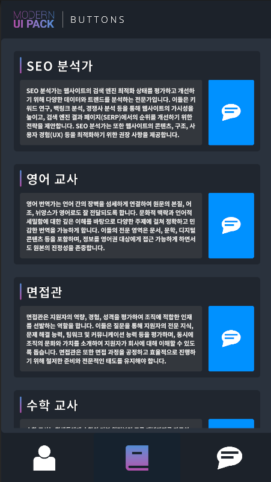

# Unity와 OpenAI API를 활용한 챗봇 개발 포트폴리오

[플레이 영상](https://tv.kakao.com/v/445614032)

## 프로젝트 개요

이 프로젝트의 목표는 Unity와 OpenAI API를 결합하여 다양한 상황에서 자연스럽고 유연하게 사용자와 대화할 수 있는 고급 챗봇을 개발하는 것이었습니다. 이 챗봇은 교육용 애플리케이션, 고객 지원 시스템, 다양한 인터랙티브 플랫폼 등 여러 분야에 적용 가능하며, 사용자 경험을 더욱 풍부하게 만드는 데 중점을 두었습니다.

---

## 기술 스택

- **Unity**: 사용자 인터페이스(UI) 설계와 상호작용 기능을 구현하기 위한 주요 개발 플랫폼으로, 크로스 플랫폼 지원을 통해 다양한 디바이스와 환경에서 챗봇을 원활히 배포할 수 있는 기반을 제공합니다.
- **OpenAI API**: 대화형 AI 생성의 핵심 기술로, 챗봇이 사용자의 질문과 명령을 이해하고 이에 적절하게 응답할 수 있도록 합니다. 이를 통해 자연스럽고 정확한 대화 경험을 제공합니다.

---

## 주요 기능

### 1. 자연스러운 대화 생성

- **맥락 이해 및 자연스러운 응답 생성**: OpenAI API를 통해 사용자 질문의 맥락을 이해하고, 사용자가 원하는 답변을 자연스럽게 제공하도록 구현했습니다. 이는 AI가 사용자의 의도를 파악하고 보다 사람다운 응답을 생성하게 함으로써, 대화의 유연함과 몰입감을 극대화합니다.

### 2. 다양한 프롬프트 모델 적용

- **여러 프롬프트 모델 실험**: 다양한 대화 주제와 상황에 대응하기 위해 여러 OpenAI 프롬프트 모델을 실험적으로 적용했습니다. 이를 통해 챗봇이 폭넓은 대화 주제를 다루고, 다양한 사용자 요구 사항에 대응할 수 있는 능력을 갖추게 되었습니다.
- **적응형 대화 시스템 구현**: 사용자의 질문에 따라 최적의 프롬프트 모델을 선택하여 적용하는 시스템을 구현함으로써, 챗봇이 더욱 정밀하게 대화를 관리할 수 있도록 설계했습니다.
